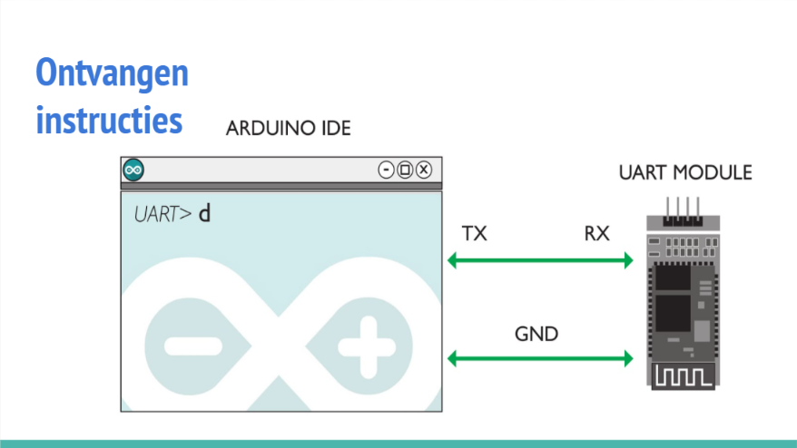

# dwenguino cursive writer

A robot arm that can write in cursive. All software is written completly in C for a AT90USB646 microcontroller. The arduino IDE is only used for it's UI for the user-friendly transmission of data. The letters are constructed with Bézier curves.

The servo's are controlled without using any libraries.
More information can be found in the [presentation](https://docs.google.com/presentation/d/1_DNR3h4yEvohyvsCSB11rR5SojcIx7sz6-yYz6VkXGw/edit?usp=sharing)

